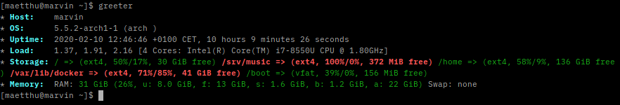

# greeter


Simple console greeter displaying some basic stuff about the system for a quick overview,  intended to run on an interactive login.



## Build

Required: Go >= 1.13  

### Linux:

```
$ git clone github.com/emgag/greeter 
$ cd greeter
$ make 
```

## License

greeter is licensed under the [MIT License](http://opensource.org/licenses/MIT).
